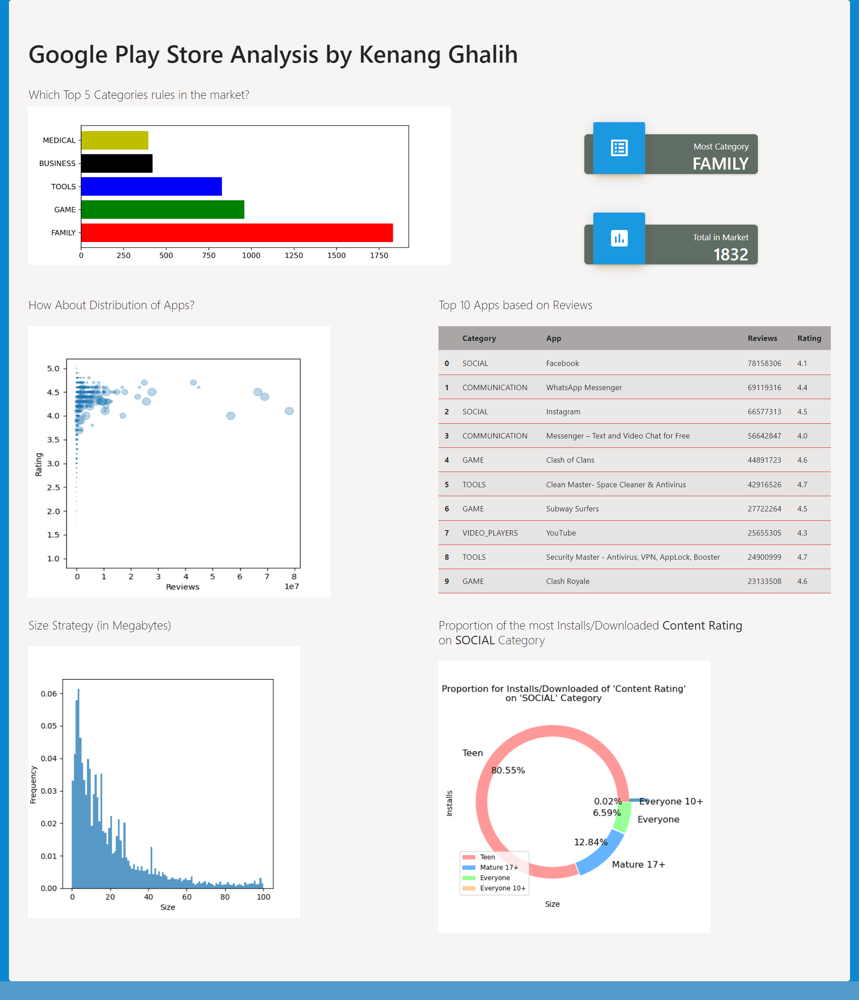

# Capstone_DA_flask-ui_KenangGhalih
This repo made for capstone project of Data Analytics Specialization @Algortima Data Science Academy - cohort Vulcan Scholarship

## Google Play Store Analytics by Kenang Ghalih

<ul>
   <li>Kenang Ghalih Diasthama</li>
   <li>Cohort: Vulcan Scholarship</li>
   <li>Data Analytics Specialization</li>
</ul>

## Overview
Data yang digunakan pada capstone project ini adalah data hasil scraping dari Google Playstore App. Data Google Playstore App terdiri dari beberapa variabe dengan rincian sebagai berikut:
- `App` : Nama aplikasi                
- `Category` : Kategori aplikasi
- `Rating` : Rating keseluruhan yang diberikan oleh user aplikasi(ketika di scrap)
- `Reviews` : Jumlah review yang diberikan oleh user aplikasi(ketika di scrap)
- `Size` : Ukuran aplikasi(ketika di scrap)           
- `Installs` : Jumlah user yang menginstall/mendownload aplikasi(Ketika di scrap)     
- `Type` : Tipe aplikasi (berbayar/gratis)       
- `Price` : Harga aplikasi (ketika di scrap)        
- `Content Rating` : Kelompok usia aplikasi ini ditargetkan - Children / Mature 21+ / Adult   
- `Genres` : Genre aplikasi.        
- `Last Updated` : Tanggal kapan aplikasi terakhir diperbarui di Play Store (ketika discrap) 
- `Current Ver` : Versi aplikasi saat ini tersedia di Play Store (ketika discrap)   
- `Android Ver` : Minimum versi Android yang diperlukan (ketika discrap)

## Rubrics
1. Setting Repository Github dan Environment (2 poin)
   - i use environment named: capstone-flask
   - i use pyhton 3.10
   - i make export latest requirements name as: requirements_capstone-flask-latest.txt
2. Data Preproses and Exploratory Data Analysis (2 poin)
3. Data Wrangling (4 poin)
4. Data Visualization (4 poin)
5. Build Flask App (4 poin)

❗note: saat run app.py. Kalau terjadi error, bisa hapus dulu file .png didalam folder assets

## Special Thanks

Finally, this capstone of DA specialization(1/3) has been finished. I'm so grateful for the opportunity that i can join to be part of big fams of Algortima Data Science School. First and Foremost, i want to say thankful to
<ol>
   <li>Mas Victor Nugraha as Instructor of P4DA</li>
   <li>Mba Nadya Aditama as Instructor of EDA</li>
   <li>Mba Dwi Gustin as Instructor of DWV</li>
   <li>Mba Dyah Nurlita as Instructor of SQL</li>
   <li>Mba Fafilia, Mba Wulan, dan kaka2 TA lainnya yg aku gabisa sebut satu persatu yg ikut membantu berjalannya sesi kelas selama ±5 pekan ini</li>
</ol>

## My Gitlab🦊

Sometimes, i often to use gitlab too..
<a href="https://gitlab.com/kenangghalih21" target="_blank"> Visit my gitlab!</a> 

Also connect to my linkedin:
<a href="https://www.linkedin.com/in/kenangghalih21/" target="_blank"> Linkedin</a> 
